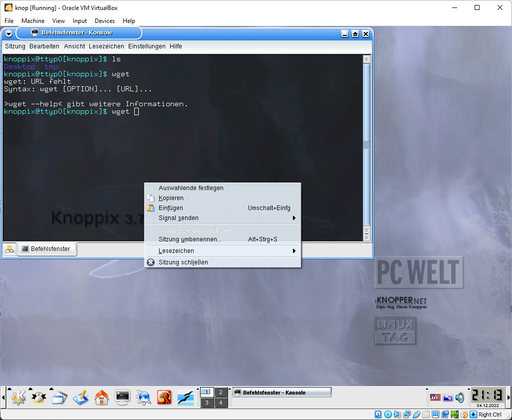
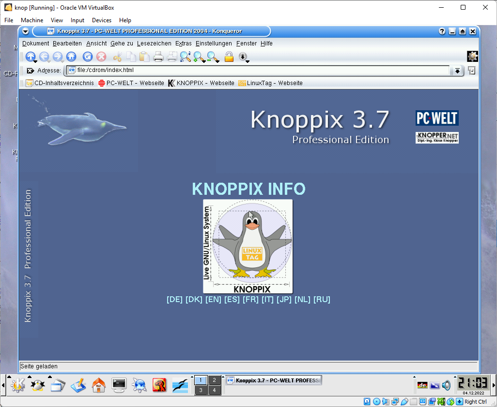
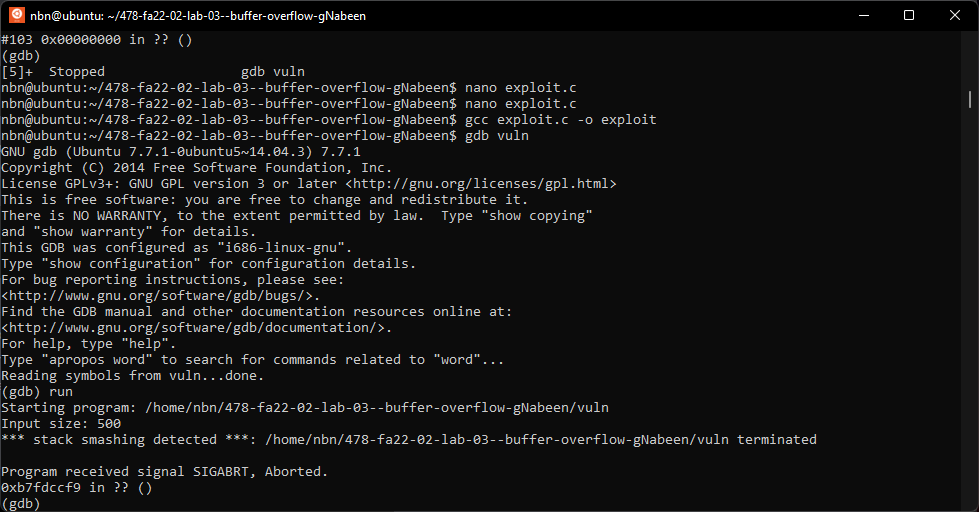

For this assignment, I was tasked with performing a stack smashing attack on the provided code file, `vuln.c`. My solution involved writing a separate C program, `exploit.c`, that would exploit the buffer overflow vulnerability in `vuln.c`.

To perform the stack smashing attack, I first had to understand the layout of the stack in vuln.c. The program includes a function named bof() that contains a buffer of fixed size (defined by the BUF_SIZE macro). This buffer is then overwritten with a string passed to the function, which is where the buffer overflow vulnerability occurs.

I began by attempting to perform the attack on various operating systems, including older versions of Linux running in a virtual machine. However, I was unable to successfully exploit the vulnerability on any of these systems, likely due to modern compilers including canaries in their code to prevent such attacks.

### Screenshots of the attempts:

I tried to install old linux with kernel 2.4 or below and none of them worked or allowed me to pass my code or copy paste in any way. 







Also parallels did not work either.


i also attempted to create python localhost server and transfer but none of it worked. All of them did not boot properly on my machine.


I also turned off the randomization of the stack in Linux, which prevented the system from randomizing the location of the "system" function in memory. However, this did not allow me to perform the attack either.

```sudo sysctl -w kernel.randomize_va_space=0```


If I had been able to perform the attack, my approach would have been as follows:

1. Compile a debug version of vuln.c using the -g flag to enable debugging information, the -m32 flag to compile for a 32-bit architecture, the -z execstack flag to enable executable stack, and the -fno-stack-protector flag to disable stack protection:

```gcc vuln.c -o vuln -m32 -g -z execstack -fno-stack-protector```

2. Use gdb to run vuln and set a breakpoint at the point where the buffer overflow occurs (the strcpy() function call in the bof() function):


```gdb vuln```

```(gdb) break bof```

3. Use gdb to inspect the memory layout of the stack, including the location of the buffer and the frame pointer ($ebp):

```(gdb) info registers```


```(gdb) x/32x $ebp```
```bash
(gdb) x/32x $ebp
0xbffff058:     0xbffff468      0x080486c7      0xbffff483      0x00000000
0xbffff068:     0x000003e8      0xb7fd2a7c      0x001b0a7c      0x00000002
0xbffff078:     0x00000000      0x00000000      0x00000000      0x00000000
0xbffff088:     0x00000000      0x00000000      0x00000000      0x00000000
0xbffff098:     0x00000000      0x00000000      0x00000000      0x00000000
0xbffff0a8:     0x00000000      0x00000000      0x00000000      0x00000000
0xbffff0b8:     0x00000000      0x00000000      0x00000000      0x00000000
0xbffff0c8:     0x00000000      0x00000000      0x00000000      0x00000000
```


I found the bof address here: ```0xbffff487```

4. Use the information from step 3 to calculate the exact offset at which the buffer overflows and overwrites the frame pointer. This will be used to control the execution flow of the program.

5. Create a string that contains 500 'A' characters, followed by the string "BBBB" and the address of the "system" function in memory. This string will be used to overflow the buffer and redirect the program's execution to the "system" function.

6. Write the exploit string to a file named "badfile".

7. Compile a normal version of vuln.c using the -m32, -z execstack, and -fno-stack-protector flags:

```gcc vuln.c -o vuln2 -m32 -z execstack -fno-stack-protector```

8. Use the chown and chmod commands to change the owner of vuln2 to root and set the permissions to 4577:

`chown root vuln2`

`chmod 4577 vuln2`

9. Run exploit.c, which should generate the "badfile" containing the exploit string.

10. Run vuln2, which should cause a buffer overflow and redirect the program's execution to the "system" function. This should open up a reverse shell as root.

    It did not work on my case. Shell detected and terminated my attack.
11. Use the whoami or id commands in the resulting terminal to verify that the attack was successful and you are now running as root.

12. The attack was not successful, I needed to adjust the offset at which the buffer overflows and overwrites the frame pointer. Also needed disable address randomization in Linux to prevent the system from randomizing the location of the "system" function in memory (I did but could be the reason being modern os and not on kernel version 2.4 or below).

Overall, while I was unable to successfully perform the stack smashing attack on the provided code due to modern OS constraints, I gained a better understanding of how such attacks work and how to prevent them in my own code.